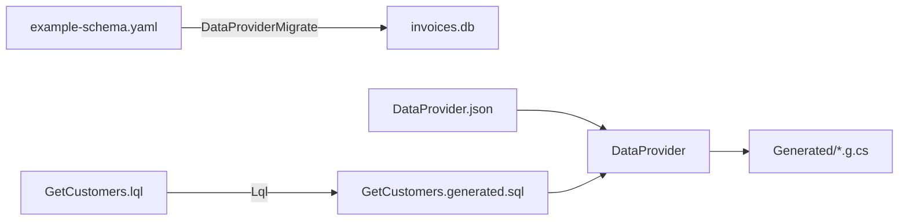

# DataProvider

A build-time CLI code generator for .NET that creates compile-time safe database extension methods from SQL and LQL query files. Every generated method returns `Result<T, SqlError>` — no exceptions, no reflection, no runtime overhead.

Supports **SQLite**, **PostgreSQL**, and **SQL Server**.

## How it works

DataProvider is a **dotnet CLI tool**, not a Roslyn analyzer. It runs during the build, reads your SQL/LQL files plus a `DataProvider.json` manifest, and emits `.g.cs` files that your project compiles normally. The three tools form a pipeline:



## Install

```bash
dotnet new tool-manifest
dotnet tool install DataProvider --version 0.9.6-beta
dotnet add package Nimblesite.DataProvider.SQLite --version 0.9.6-beta
```

Replace `SQLite` with `Postgres` or `SqlServer` as needed.

## Runtime packages

| Package | Purpose |
|---------|---------|
| `Nimblesite.DataProvider.Core` | Shared runtime types (`Result<T,E>`, `SqlError`) |
| `Nimblesite.DataProvider.SQLite` | SQLite runtime |
| `Nimblesite.DataProvider.Postgres` | PostgreSQL runtime |
| `Nimblesite.DataProvider.SqlServer` | SQL Server runtime |

## DataProvider.json

Describes what to generate from your SQL/LQL files and tables:

```json
{
  "connectionString": "Data Source=app.db",
  "queries": [
    {
      "name": "GetCustomers",
      "sqlFile": "GetCustomers.generated.sql"
    }
  ],
  "tables": [
    {
      "schema": "main",
      "name": "Customer",
      "primaryKeyColumns": ["Id"],
      "generateInsert": true,
      "generateUpdate": true,
      "generateDelete": true
    }
  ]
}
```

## Running the generator

Manually:

```bash
dotnet DataProvider sqlite --project-dir . --config DataProvider.json --out ./Generated
dotnet DataProvider postgres --project-dir . --config DataProvider.json --out ./Generated --connection-string "Host=localhost;Database=mydb;..."
```

Or wire it into MSBuild so every build regenerates code:

```xml
<Target Name="RunDataProvider" BeforeTargets="CoreCompile">
  <Exec Command="dotnet DataProvider sqlite --project-dir . --config DataProvider.json --out ./Generated" />
  <ItemGroup>
    <Compile Include="Generated/**/*.g.cs" />
  </ItemGroup>
</Target>
```

## Using generated methods

DataProvider **never throws**. Every method returns `Result<T, SqlError>`:

```csharp
using Microsoft.Data.Sqlite;
using Nimblesite.DataProvider.Core;
using MyApp.Generated;

await using var connection = new SqliteConnection("Data Source=app.db");
await connection.OpenAsync();

var result = await connection.GetCustomersAsync(customerId: null);

switch (result)
{
    case Result<IReadOnlyList<GetCustomersRow>, SqlError>.Ok ok:
        foreach (var customer in ok.Value)
            Console.WriteLine($"{customer.Id}: {customer.CustomerName}");
        break;

    case Result<IReadOnlyList<GetCustomersRow>, SqlError>.Error err:
        Console.Error.WriteLine($"Query failed: {err.Value.Message}");
        break;
}
```

Generated row types are immutable records. Generated insert/update/delete methods also return `Result<...>`.

## Related

- [LQL](../Lql/README.md) — cross-database query language that transpiles to SQL
- [Migrations](../Migration/README.md) — YAML schema definitions consumed by `DataProviderMigrate`
- Migration CLI spec: [docs/specs/migration-cli-spec.md](../docs/specs/migration-cli-spec.md)
