# Gatekeeper: Authentication & Authorization Microservice

## Overview

Gatekeeper is an independent, deployable authentication and authorization microservice implementing:
- **Passkey-only authentication** (WebAuthn/FIDO2) - no passwords
- **Fine-grained RBAC** with record-level permissions
- **Allows C# attributes to specify permissions or roles at code level** - distinc from .NET ABAC

This service is framework-agnostic and can be integrated with any system via REST API.

---

## Authoritative References

### WebAuthn/FIDO2 Standards
- [W3C WebAuthn Specification](https://www.w3.org/TR/webauthn-3/)
- [FIDO Alliance Technical Specifications](https://fidoalliance.org/specs/fido-v2.0-id-20180227/fido-client-to-authenticator-protocol-v2.0-id-20180227.html)
- [WebAuthn Guide (webauthn.guide)](https://webauthn.guide/)

### ASP.NET Core Implementation
- [ASP.NET Core Passkeys Documentation](https://learn.microsoft.com/en-us/aspnet/core/security/authentication/passkeys/?view=aspnetcore-10.0)
- [fido2-net-lib GitHub](https://github.com/passwordless-lib/fido2-net-lib) - Recommended library for .NET 9
- [Syncfusion FIDO2 Tutorial](https://www.syncfusion.com/blogs/post/passkey-in-asp-dotnet-core-with-fido2)
- [damienbod/AspNetCoreIdentityFido2Mfa](https://github.com/damienbod/AspNetCoreIdentityFido2Mfa) - .NET 9 reference implementation

### React Implementation
- [SimpleWebAuthn Documentation](https://simplewebauthn.dev/docs/packages/browser/)
- [SimpleWebAuthn Server Package](https://simplewebauthn.dev/docs/packages/server)
- [Complete React + WebAuthn Guide](https://medium.com/@siddhantahire98/building-a-modern-authentication-system-with-webauthn-passkeys-a-complete-guide-65cac3511049)

### Access Control Design
- [NocoBase RBAC Design Guide](https://www.nocobase.com/en/blog/how-to-design-rbac-role-based-access-control-system)
- [Oso RBAC Layer Guide](https://www.osohq.com/learn/rbac-role-based-access-control)
- [SQLFlash Fine-Grained RBAC](https://sqlflash.ai/article/20250617-2/)
- [Hoop.dev Fine-Grained Access Control](https://hoop.dev/blog/fine-grained-access-control-and-rbac-building-secure-and-scalable-permission-systems/)
- [Permify Fine-Grained Access](https://permify.co/post/fine-grained-access-control-where-rbac-falls-short/)

---

## Architecture

```
┌─────────────────────────────────────────────────────────────────┐
│                     Client Application                          │
│                   (React Dashboard, etc.)                       │
│                                                                 │
│  ┌─────────────────┐    ┌─────────────────┐                    │
│  │ @simplewebauthn │    │ API Client      │                    │
│  │ /browser        │    │ (fetch/axios)   │                    │
│  └────────┬────────┘    └────────┬────────┘                    │
└───────────┼──────────────────────┼──────────────────────────────┘
            │                      │
            ▼                      ▼
┌─────────────────────────────────────────────────────────────────┐
│                    Gatekeeper API (:5002)                       │
│                                                                 │
│  ┌─────────────────────────────────────────────────────────┐   │
│  │                  Authentication Layer                    │   │
│  │  POST /auth/register/begin     - Start passkey creation │   │
│  │  POST /auth/register/complete  - Finish registration    │   │
│  │  POST /auth/login/begin        - Start authentication   │   │
│  │  POST /auth/login/complete     - Finish authentication  │   │
│  │  POST /auth/logout             - Invalidate session     │   │
│  │  GET  /auth/session            - Get current session    │   │
│  └─────────────────────────────────────────────────────────┘   │
│                                                                 │
│  ┌─────────────────────────────────────────────────────────┐   │
│  │                  Authorization Layer                     │   │
│  │  GET  /authz/check             - Check permission       │   │
│  │  GET  /authz/permissions       - List user permissions  │   │
│  │  POST /authz/evaluate          - Bulk permission check  │   │
│  └─────────────────────────────────────────────────────────┘   │
│                                                                 │
│  ┌─────────────────────────────────────────────────────────┐   │
│  │                  Admin API (protected)                   │   │
│  │  /admin/users      - User management                    │   │
│  │  /admin/roles      - Role management                    │   │
│  │  /admin/permissions - Permission management             │   │
│  │  /admin/policies   - ABAC policy management             │   │
│  └─────────────────────────────────────────────────────────┘   │
│                                                                 │
│  ┌─────────────────────────────────────────────────────────┐   │
│  │              fido2-net-lib (Fido2.AspNet)               │   │
│  │         Attestation & Assertion verification            │   │
│  └─────────────────────────────────────────────────────────┘   │
└────────────────────────────┬────────────────────────────────────┘
                             │
                             ▼
┌─────────────────────────────────────────────────────────────────┐
│                       Database                           │
│                                                                 │
│  Users ──┬── Credentials (passkeys)                            │
│          ├── UserRoles ── Roles ── RolePermissions             │
│          └── UserPermissions (direct grants)                   │
│                              │                                  │
│                              ▼                                  │
│  Permissions ── ResourceType + Action + Scope                  │
│                                                                 │
│  Policies (ABAC) ── Conditions + Attributes                    │
└─────────────────────────────────────────────────────────────────┘
```

---

## Database Schema

```mermaid
erDiagram
    %% ═══════════════════════════════════════════════════════════════
    %% CORE AUTHENTICATION
    %% ═══════════════════════════════════════════════════════════════

    gk_user {
        text id PK "UUID"
        text display_name "NOT NULL"
        text email UK "Unique index"
        text created_at "NOT NULL, ISO8601"
        text last_login_at "ISO8601"
        boolean is_active "NOT NULL, default 1"
        json metadata "Extensibility"
    }

    gk_credential {
        text id PK "Base64URL credential ID"
        text user_id FK "NOT NULL"
        blob public_key "NOT NULL, COSE format"
        int sign_count "NOT NULL, default 0"
        text aaguid "Authenticator AAGUID"
        text credential_type "NOT NULL, 'public-key'"
        json transports "['internal','usb','ble','nfc']"
        text attestation_format
        text created_at "NOT NULL"
        text last_used_at
        text device_name "User-friendly name"
        boolean is_backup_eligible "BE flag"
        boolean is_backed_up "BS flag"
    }

    gk_session {
        text id PK "JWT JTI"
        text user_id FK "NOT NULL"
        text credential_id FK
        text created_at "NOT NULL"
        text expires_at "NOT NULL"
        text last_activity_at "NOT NULL"
        text ip_address
        text user_agent
        boolean is_revoked "NOT NULL, default 0"
    }

    gk_challenge {
        text id PK "UUID"
        text user_id "NULL for login"
        blob challenge "NOT NULL, crypto random"
        text type "NOT NULL, registration|authentication"
        text created_at "NOT NULL"
        text expires_at "NOT NULL, 5 min"
    }

    %% ═══════════════════════════════════════════════════════════════
    %% RBAC
    %% ═══════════════════════════════════════════════════════════════

    gk_role {
        text id PK
        text name UK "NOT NULL, unique"
        text description
        boolean is_system "NOT NULL, default 0"
        text created_at "NOT NULL"
        text parent_role_id FK "Role hierarchy"
    }

    gk_user_role {
        text user_id PK,FK "Composite PK"
        text role_id PK,FK "Composite PK"
        text granted_at "NOT NULL"
        text granted_by FK
        text expires_at "Temporal grants"
    }

    gk_permission {
        text id PK
        text code UK "NOT NULL, e.g. patient:read"
        text resource_type "NOT NULL"
        text action "NOT NULL, read|write|delete"
        text description
        text created_at "NOT NULL"
    }

    gk_role_permission {
        text role_id PK,FK "Composite PK"
        text permission_id PK,FK "Composite PK"
        text granted_at "NOT NULL"
    }

    gk_user_permission {
        text user_id FK "NOT NULL"
        text permission_id FK "NOT NULL"
        text scope_type "all|record|query"
        text scope_value "Record ID or LQL query"
        text granted_at "NOT NULL"
        text granted_by FK
        text expires_at
        text reason "Audit trail"
    }

    %% ═══════════════════════════════════════════════════════════════
    %% FINE-GRAINED ACCESS CONTROL
    %% ═══════════════════════════════════════════════════════════════

    gk_resource_grant {
        text id PK
        text user_id FK "NOT NULL"
        text resource_type "NOT NULL, e.g. patient"
        text resource_id "NOT NULL, e.g. patient-uuid"
        text permission_id FK "NOT NULL"
        text granted_at "NOT NULL"
        text granted_by FK
        text expires_at
    }

    gk_policy {
        text id PK
        text name UK "NOT NULL"
        text description
        text resource_type "NOT NULL"
        text action "NOT NULL"
        json condition "NOT NULL, JSON expression"
        text effect "NOT NULL, allow|deny"
        int priority "NOT NULL, default 0"
        boolean is_active "NOT NULL, default 1"
        text created_at "NOT NULL"
    }

    %% ═══════════════════════════════════════════════════════════════
    %% RELATIONSHIPS
    %% ═══════════════════════════════════════════════════════════════

    gk_user ||--o{ gk_credential : "has passkeys"
    gk_user ||--o{ gk_session : "has sessions"
    gk_credential ||--o{ gk_session : "authenticates"

    gk_user ||--o{ gk_user_role : "assigned to"
    gk_role ||--o{ gk_user_role : "has members"
    gk_user ||--o{ gk_user_role : "grants (granted_by)"

    gk_role ||--o| gk_role : "inherits from (parent)"

    gk_role ||--o{ gk_role_permission : "has"
    gk_permission ||--o{ gk_role_permission : "granted to"

    gk_user ||--o{ gk_user_permission : "has direct"
    gk_permission ||--o{ gk_user_permission : "granted directly"
    gk_user ||--o{ gk_user_permission : "grants (granted_by)"

    gk_user ||--o{ gk_resource_grant : "has access to"
    gk_permission ||--o{ gk_resource_grant : "defines access"
    gk_user ||--o{ gk_resource_grant : "grants (granted_by)"
```



**Policy Condition Examples** (stored as JSON):
```json
{ "user.department": "finance", "resource.status": "draft" }
{ "time.hour": { "$gte": 9, "$lte": 17 } }
{ "user.id": { "$eq": "resource.owner_id" } }
```

---

## API Specification

### Authentication Endpoints

#### POST /auth/register/begin
Start passkey registration for a new or existing user.

**Request:**
```json
{
  "email": "user@example.com",
  "displayName": "John Doe"
}
```

**Response:**
```json
{
  "challengeId": "uuid",
  "options": {
    "challenge": "base64url-encoded-challenge",
    "rp": {
      "name": "Gatekeeper",
      "id": "localhost"
    },
    "user": {
      "id": "base64url-user-id",
      "name": "user@example.com",
      "displayName": "John Doe"
    },
    "pubKeyCredParams": [
      { "type": "public-key", "alg": -7 },
      { "type": "public-key", "alg": -257 }
    ],
    "timeout": 60000,
    "attestation": "none",
    "authenticatorSelection": {
      "authenticatorAttachment": "platform",
      "residentKey": "required",
      "userVerification": "required"
    }
  }
}
```

#### POST /auth/register/complete
Complete passkey registration with authenticator response.

**Request:**
```json
{
  "challengeId": "uuid",
  "response": {
    "id": "credential-id",
    "rawId": "base64url",
    "type": "public-key",
    "response": {
      "clientDataJSON": "base64url",
      "attestationObject": "base64url"
    }
  },
  "deviceName": "MacBook Pro Touch ID"
}
```

**Response:**
```json
{
  "userId": "user-uuid",
  "credentialId": "credential-id",
  "session": {
    "token": "session-token",
    "expiresAt": "2025-12-22T00:00:00Z"
  }
}
```

#### POST /auth/login/begin
Start passkey authentication.

**Request:**
```json
{
  "email": "user@example.com"  // Optional - for discoverable credentials
}
```

**Response:**
```json
{
  "challengeId": "uuid",
  "options": {
    "challenge": "base64url-encoded-challenge",
    "timeout": 60000,
    "rpId": "localhost",
    "allowCredentials": [],  // Empty for discoverable credentials
    "userVerification": "required"
  }
}
```

#### POST /auth/login/complete
Complete passkey authentication.

**Request:**
```json
{
  "challengeId": "uuid",
  "response": {
    "id": "credential-id",
    "rawId": "base64url",
    "type": "public-key",
    "response": {
      "clientDataJSON": "base64url",
      "authenticatorData": "base64url",
      "signature": "base64url",
      "userHandle": "base64url"
    }
  }
}
```

**Response:**
```json
{
  "userId": "user-uuid",
  "displayName": "John Doe",
  "session": {
    "token": "session-token",
    "expiresAt": "2025-12-22T00:00:00Z"
  }
}
```

#### GET /auth/session
Get current session info.

**Headers:** `Authorization: Bearer <session-token>`

**Response:**
```json
{
  "userId": "user-uuid",
  "displayName": "John Doe",
  "email": "user@example.com",
  "roles": ["admin", "clinician"],
  "expiresAt": "2025-12-22T00:00:00Z"
}
```

#### POST /auth/logout
Invalidate current session.

**Headers:** `Authorization: Bearer <session-token>`

**Response:** `204 No Content`

---

### Authorization Endpoints

#### GET /authz/check
Check if current user has a specific permission.

**Headers:** `Authorization: Bearer <session-token>`

**Query Parameters:**
- `permission` - Permission code (e.g., `patient:read`)
- `resourceType` - Optional resource type
- `resourceId` - Optional specific resource ID

**Response:**
```json
{
  "allowed": true,
  "reason": "role:admin grants patient:read",
  "evaluatedPolicies": ["default-admin-policy"]
}
```

#### POST /authz/evaluate
Bulk permission evaluation.

**Request:**
```json
{
  "checks": [
    { "permission": "patient:read", "resourceId": "patient-123" },
    { "permission": "patient:write", "resourceId": "patient-123" },
    { "permission": "order:delete", "resourceId": "order-456" }
  ]
}
```

**Response:**
```json
{
  "results": [
    { "permission": "patient:read", "resourceId": "patient-123", "allowed": true },
    { "permission": "patient:write", "resourceId": "patient-123", "allowed": true },
    { "permission": "order:delete", "resourceId": "order-456", "allowed": false }
  ]
}
```

#### GET /authz/permissions
List all effective permissions for current user.

**Response:**
```json
{
  "permissions": [
    {
      "code": "patient:read",
      "source": "role:clinician",
      "scope": "all"
    },
    {
      "code": "patient:write",
      "source": "direct-grant",
      "scope": "record",
      "scopeValue": "patient-123"
    }
  ]
}
```

---

### Admin Endpoints

All admin endpoints require the `admin:*` permission.

#### Users
- `GET /admin/users` - List users
- `GET /admin/users/{id}` - Get user details
- `POST /admin/users` - Create user (generates registration link)
- `PUT /admin/users/{id}` - Update user
- `DELETE /admin/users/{id}` - Deactivate user
- `GET /admin/users/{id}/credentials` - List user's passkeys
- `DELETE /admin/users/{id}/credentials/{credentialId}` - Revoke passkey

#### Roles
- `GET /admin/roles` - List roles
- `GET /admin/roles/{id}` - Get role with permissions
- `POST /admin/roles` - Create role
- `PUT /admin/roles/{id}` - Update role
- `DELETE /admin/roles/{id}` - Delete role (if not system role)
- `POST /admin/roles/{id}/permissions` - Add permission to role
- `DELETE /admin/roles/{id}/permissions/{permissionId}` - Remove permission

#### Permissions
- `GET /admin/permissions` - List permissions
- `POST /admin/permissions` - Create permission
- `DELETE /admin/permissions/{id}` - Delete permission

#### User Grants
- `POST /admin/users/{id}/roles` - Assign role to user
- `DELETE /admin/users/{id}/roles/{roleId}` - Remove role
- `POST /admin/users/{id}/permissions` - Direct permission grant
- `DELETE /admin/users/{id}/permissions/{permissionId}` - Revoke grant
- `POST /admin/users/{id}/resources` - Grant resource-level access
- `DELETE /admin/users/{id}/resources/{grantId}` - Revoke resource access

---

## Project Structure

```
Samples/
└── Gatekeeper/
    ├── spec.md                          # This file
    ├── Gatekeeper.Api/
    │   ├── Gatekeeper.Api.csproj
    │   ├── Program.cs                   # Minimal API setup
    │   ├── GlobalUsings.cs
    │   ├── Endpoints/
    │   │   ├── AuthEndpoints.cs         # /auth/* routes
    │   │   ├── AuthzEndpoints.cs        # /authz/* routes
    │   │   └── AdminEndpoints.cs        # /admin/* routes
    │   ├── Services/
    │   │   ├── PasskeyService.cs        # fido2-net-lib wrapper
    │   │   ├── SessionService.cs        # Session management
    │   │   ├── AuthorizationService.cs  # Permission evaluation
    │   │   └── PolicyEvaluator.cs       # ABAC policy engine
    │   ├── Middleware/
    │   │   └── AuthMiddleware.cs        # Session validation
    │   ├── Sql/
    │   │   ├── GetUserByEmail.sql
    │   │   ├── GetUserCredentials.sql
    │   │   ├── InsertCredential.sql
    │   │   ├── GetUserPermissions.sql
    │   │   ├── CheckResourceGrant.sql
    │   │   └── ... (DataProvider SQL files)
    │   └── gatekeeper.db
    │
    ├── Gatekeeper.Api.Tests/
    │   ├── Gatekeeper.Api.Tests.csproj
    │   ├── AuthenticationTests.cs
    │   ├── AuthorizationTests.cs
    │   └── PermissionTests.cs
    │
    └── Gatekeeper.Migration/
        ├── Gatekeeper.Migration.csproj
        └── Schema.cs                     # Migration SchemaBuilder
```

---

## Implementation Guide

### Dependencies (NuGet)

```xml
<!-- Gatekeeper.Api.csproj -->
<PackageReference Include="Fido2" Version="4.*" />
<PackageReference Include="Fido2.AspNet" Version="4.*" />
<PackageReference Include="Microsoft.Data.Sqlite" Version="9.*" />
```

### FIDO2 Configuration

```csharp
// Program.cs
builder.Services.AddFido2(options =>
{
    options.ServerDomain = builder.Configuration["Fido2:ServerDomain"] ?? "localhost";
    options.ServerName = "Gatekeeper";
    options.Origins = new HashSet<string>
    {
        builder.Configuration["Fido2:Origin"] ?? "http://localhost:5173"
    };
    options.TimestampDriftTolerance = 300000; // 5 minutes
});
```

### React Integration

```typescript
// Using @simplewebauthn/browser
import {
  startRegistration,
  startAuthentication
} from '@simplewebauthn/browser';

// Registration
async function registerPasskey() {
  const beginResp = await fetch('/auth/register/begin', {
    method: 'POST',
    headers: { 'Content-Type': 'application/json' },
    body: JSON.stringify({ email, displayName })
  });
  const { challengeId, options } = await beginResp.json();

  // Trigger browser passkey creation
  const credential = await startRegistration(options);

  const completeResp = await fetch('/auth/register/complete', {
    method: 'POST',
    headers: { 'Content-Type': 'application/json' },
    body: JSON.stringify({ challengeId, response: credential })
  });

  return completeResp.json();
}

// Authentication
async function loginWithPasskey() {
  const beginResp = await fetch('/auth/login/begin', { method: 'POST' });
  const { challengeId, options } = await beginResp.json();

  const assertion = await startAuthentication(options);

  const completeResp = await fetch('/auth/login/complete', {
    method: 'POST',
    headers: { 'Content-Type': 'application/json' },
    body: JSON.stringify({ challengeId, response: assertion })
  });

  return completeResp.json();
}
```

---

## Permission Model Examples

### High-Level Permissions (Menu Access)
```
menu:dashboard:access     - Can see dashboard
menu:patients:access      - Can see patients menu
menu:admin:access         - Can see admin menu
```

### Resource Permissions (CRUD)
```
patient:create            - Can create patients
patient:read              - Can read any patient
patient:write             - Can update any patient
patient:delete            - Can delete any patient

order:create
order:read
order:write
order:delete
```

### Record-Level Permissions
Granted via `POST /admin/users/{id}/resources`:
```json
// User can only read order 123456
{
  "resourceType": "order",
  "resourceId": "123456",
  "permissionCode": "order:read"
}

// User can write to order 54345
{
  "resourceType": "order",
  "resourceId": "54345",
  "permissionCode": "order:write"
}
```

### ABAC Policy Examples
```json
// Policy: Users can only edit resources they own
{
  "name": "owner-edit-policy",
  "resource_type": "*",
  "action": "write",
  "condition": {
    "user.id": { "$eq": "resource.owner_id" }
  },
  "effect": "allow"
}

// Policy: Finance users can only access finance resources during business hours
{
  "name": "finance-time-restriction",
  "resource_type": "finance_report",
  "action": "*",
  "condition": {
    "$and": [
      { "user.department": "finance" },
      { "context.hour": { "$gte": 9, "$lte": 17 } },
      { "context.day_of_week": { "$in": [1, 2, 3, 4, 5] } }
    ]
  },
  "effect": "allow"
}

// Policy: Deny access to archived records except for admins
{
  "name": "archived-restriction",
  "resource_type": "*",
  "action": "*",
  "condition": {
    "$and": [
      { "resource.status": "archived" },
      { "user.roles": { "$nin": ["admin"] } }
    ]
  },
  "effect": "deny",
  "priority": 100
}
```

---

## Authorization Decision Flow

```
┌─────────────────────────────────────────────────────────────────┐
│                    Authorization Request                        │
│   User: user-123, Permission: order:write, Resource: order-456 │
└────────────────────────────┬────────────────────────────────────┘
                             │
                             ▼
┌─────────────────────────────────────────────────────────────────┐
│ Step 1: Check explicit DENY policies (highest priority first)  │
│   → If any DENY matches → DENY                                 │
└────────────────────────────┬────────────────────────────────────┘
                             │ No DENY
                             ▼
┌─────────────────────────────────────────────────────────────────┐
│ Step 2: Check resource-level grants (gk_resource_grant)        │
│   → SELECT * FROM gk_resource_grant                            │
│     WHERE user_id = ? AND resource_type = ?                    │
│       AND resource_id = ? AND permission_id = ?                │
│   → If found and not expired → ALLOW                           │
└────────────────────────────┬────────────────────────────────────┘
                             │ Not found
                             ▼
┌─────────────────────────────────────────────────────────────────┐
│ Step 3: Check direct user permissions (gk_user_permission)     │
│   → If scope='all' → ALLOW                                     │
│   → If scope='record' and scope_value matches → ALLOW          │
└────────────────────────────┬────────────────────────────────────┘
                             │ Not found
                             ▼
┌─────────────────────────────────────────────────────────────────┐
│ Step 4: Check role permissions (gk_role_permission via roles)  │
│   → Traverse role hierarchy                                    │
│   → If permission found in any role → ALLOW                    │
└────────────────────────────┬────────────────────────────────────┘
                             │ Not found
                             ▼
┌─────────────────────────────────────────────────────────────────┐
│ Step 5: Evaluate ABAC ALLOW policies                           │
│   → If any ALLOW policy matches → ALLOW                        │
└────────────────────────────┬────────────────────────────────────┘
                             │ No match
                             ▼
┌─────────────────────────────────────────────────────────────────┐
│                      Default: DENY                              │
└─────────────────────────────────────────────────────────────────┘
```

---

## Security Considerations

1. **No Password Storage** - Only public keys stored; private keys never leave user devices
2. **Challenge Expiry** - All challenges expire after 5 minutes
3. **Session Rotation** - Sessions can be invalidated server-side
4. **Sign Count Verification** - Detect cloned authenticators
5. **User Verification Required** - Biometric/PIN required for all operations
6. **Audit Logging** - All authentication and authorization events logged

---

## Integration with Other Services

Other microservices integrate via middleware:

```csharp
// In Clinical.Api or Scheduling.Api
app.Use(async (context, next) =>
{
    var token = context.Request.Headers["Authorization"]
        .ToString()
        .Replace("Bearer ", "");

    if (string.IsNullOrEmpty(token))
    {
        context.Response.StatusCode = 401;
        return;
    }

    // Validate with Gatekeeper
    using var client = new HttpClient();
    var response = await client.GetAsync(
        $"http://localhost:5002/auth/session",
        new HttpRequestMessage { Headers = { Authorization = new("Bearer", token) } }
    );

    if (!response.IsSuccessStatusCode)
    {
        context.Response.StatusCode = 401;
        return;
    }

    var session = await response.Content.ReadFromJsonAsync<SessionInfo>();
    context.Items["User"] = session;

    await next();
});
```

Or via shared library:
```csharp
// Gatekeeper.Client library
services.AddGatekeeperAuth(options =>
{
    options.GatekeeperUrl = "http://localhost:5002";
});

// Then in endpoints:
app.MapGet("/fhir/Patient", async (HttpContext ctx) =>
{
    var authz = ctx.RequestServices.GetRequiredService<IGatekeeperClient>();
    if (!await authz.CheckAsync("patient:read"))
        return Results.Forbid();

    // ... handle request
});
```

---

## Default Roles & Permissions

Seeded via `Gatekeeper.Migration` on first run:

| Role | Description | System? |
|------|-------------|---------|
| `admin` | Full system access | Yes |
| `user` | Basic authenticated user | Yes |

| Permission Code | Resource | Action | Description |
|-----------------|----------|--------|-------------|
| `admin:*` | admin | * | Full admin access |
| `user:profile` | user | read | View own profile |
| `user:credentials` | user | manage | Manage own passkeys |

| Role | Permissions |
|------|-------------|
| `admin` | `admin:*` |
| `user` | `user:profile`, `user:credentials` |

---

## Sync Support

Gatekeeper integrates with the existing Sync infrastructure for multi-node deployments. Sync triggers are enabled on permission tables via the `Sync.SQLite` schema extensions (uses existing `Sync.Http` infrastructure).

---

## Open Questions

1. **Token Format**: JWT vs opaque session tokens?
   - Current spec uses opaque tokens for server-side revocation
   - JWT could be added for stateless verification in edge cases

2. **Cross-Origin Passkeys**: Support for passkeys across subdomains?
   - Requires careful RP ID configuration

3. **Recovery Flow**: What happens if user loses all devices?
   - Admin-initiated account recovery?
   - Backup codes? (against passkey-only philosophy)

---

## Version History

| Version | Date | Changes |
|---------|------|---------|
| 1.0.0 | 2025-12-21 | Initial specification |
