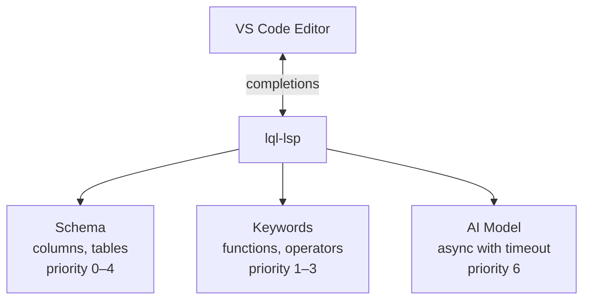

The LQL Language Server has built-in support for AI-powered code completions. Connect a local model via Ollama or use a cloud provider to get intelligent, context-aware query suggestions alongside the standard schema and keyword completions.

## How It Works



On every completion request, the LSP runs three sources **in parallel**:

1. **Schema completions** (priority 0-4) - Table names, column names from your database
2. **Keyword completions** (priority 1-3) - Pipeline operations, functions, keywords
3. **AI completions** (priority 6) - Intelligent suggestions from a language model

All results are merged and sorted by priority. Schema and keyword completions always appear first; AI suggestions supplement them at the bottom. If the AI model is slow or unavailable, you still get instant schema and keyword completions.

## Timeout Enforcement

AI completions are wrapped in a configurable timeout (default: 2000ms). If the model doesn't respond in time, the LSP silently drops the AI results and returns only schema/keyword completions. This guarantees the editor never feels sluggish, regardless of AI model latency.

## What the AI Model Receives

Every completion request sends the AI model rich context about your current editing state:

| Context | Description |
|---------|-------------|
| **Full document** | The complete `.lql` file text |
| **Cursor position** | Line and column number |
| **Line prefix** | Text from the start of the line to the cursor |
| **Word prefix** | The partial word being typed |
| **File URI** | Path to the current file |
| **Table names** | All tables from the database schema |
| **Schema description** | Compact schema: `users(id uuid PK NOT NULL, name text, email text)` |

The schema description gives the model full knowledge of your database structure, so it can suggest syntactically valid and schema-aware queries.

## Setup with Ollama (Recommended)

[Ollama](https://ollama.com) runs language models locally on your machine. No API keys, no cloud, no data leaves your laptop.

### 1. Install Ollama

Download and install from [ollama.com](https://ollama.com).

### 2. Pull a Code Model

```bash
ollama pull qwen2.5-coder:1.5b
```

### 3. Configure VS Code

Add to your `settings.json`:

```json
{
  "lql.aiProvider": {
    "provider": "ollama",
    "endpoint": "http://localhost:11434/api/generate",
    "model": "qwen2.5-coder:1.5b",
    "enabled": true
  }
}
```

### 4. Start Writing LQL

Open any `.lql` file and start typing. AI suggestions appear in the completion list alongside schema and keyword completions, marked as **Snippet** items.

## Recommended Models

| Model | Parameters | Speed | Quality | Best For |
|-------|-----------|-------|---------|----------|
| `qwen2.5-coder:1.5b` | 1.5B | Fast | Good | Daily use, quick responses |
| `deepseek-coder:1.3b` | 1.3B | Fast | Good | Lightweight alternative |
| `codellama:7b` | 7B | Moderate | Better | Complex queries, more context |
| `qwen2.5-coder:7b` | 7B | Moderate | Better | Higher quality suggestions |

For the best experience, start with `qwen2.5-coder:1.5b` - it provides good suggestions with minimal latency.

## Provider Configuration

The AI provider is configured via `initializationOptions` during the LSP handshake, which VS Code passes from your settings:

```json
{
  "lql.aiProvider": {
    "provider": "ollama",
    "endpoint": "http://localhost:11434/api/generate",
    "model": "qwen2.5-coder:1.5b",
    "apiKey": "",
    "timeoutMs": 2000,
    "enabled": true
  }
}
```

### Configuration Fields

| Field | Type | Default | Description |
|-------|------|---------|-------------|
| `provider` | string | *required* | Provider type: `ollama`, `openai`, `anthropic`, `custom` |
| `endpoint` | string | *required* | Full URL of the API endpoint |
| `model` | string | `"default"` | Model identifier (provider-specific) |
| `apiKey` | string | `null` | API key for cloud providers |
| `timeoutMs` | number | `2000` | Maximum time to wait for AI response (ms) |
| `enabled` | boolean | `true` | Enable/disable AI completions |

## Supported Providers

### Ollama (Local)

Runs entirely on your machine. The LSP calls the Ollama `/api/generate` endpoint and injects the [LQL language reference](https://github.com/Nimblesite/DataProvider/blob/main/Lql/lql-lsp-rust/crates/lql-reference.md) as system context, giving the model knowledge of LQL syntax.

```json
{
  "provider": "ollama",
  "endpoint": "http://localhost:11434/api/generate",
  "model": "qwen2.5-coder:1.5b"
}
```

The Ollama provider:
- Sends the full document, cursor position, and schema as a structured prompt
- Uses low temperature (0.1) for deterministic, focused completions
- Limits response to 256 tokens for fast turnaround
- Parses the model's JSON array response into completion items
- Handles markdown code fence wrapping in model responses

### OpenAI / Anthropic / Custom (Cloud)

Configure any OpenAI-compatible or custom endpoint:

```json
{
  "provider": "openai",
  "endpoint": "https://api.openai.com/v1/completions",
  "model": "gpt-4",
  "apiKey": "sk-..."
}
```

Cloud providers require an API key. The same context (document, cursor, schema) is sent to the model.

### Custom Providers

Set `provider` to `"custom"` and point `endpoint` to any API that accepts the same prompt format. The LSP logs the configuration on startup so you can verify it's active.

## How AI Completions Merge

The completion pipeline works as follows:

1. **Schema + keyword completions** are computed synchronously (instant)
2. **AI completions** are requested asynchronously with a timeout
3. If AI responds within the timeout, results are appended to the list
4. If AI times out, only schema + keyword results are returned
5. All items are sorted by `sort_priority` before sending to the editor

```
Priority 0: Column completions (users.id, users.name)
Priority 1: Pipeline operations (select, filter, join)
Priority 2: Functions (count, sum, avg, concat)
Priority 3: Keywords (let, fn, as, and, or)
Priority 4: Table names (users, orders, products)
Priority 5: Let bindings (active_users, joined)
Priority 6: AI suggestions (context-aware snippets)
```

This means AI suggestions never push schema completions out of view - they always appear at the bottom of the list as supplementary suggestions.

## Disabling AI

To disable AI completions without removing the configuration:

```json
{
  "lql.aiProvider": {
    "provider": "ollama",
    "endpoint": "http://localhost:11434/api/generate",
    "model": "qwen2.5-coder:1.5b",
    "enabled": false
  }
}
```

Or simply remove the `lql.aiProvider` section from your settings.

## Troubleshooting

### No AI completions appearing

1. Check the **LQL Language Server** output channel (`View > Output > LQL Language Server`) for provider activation messages
2. Verify Ollama is running: `curl http://localhost:11434/api/tags`
3. Verify the model is pulled: `ollama list`
4. Check `enabled` is not set to `false`

### AI completions are slow

1. Try a smaller model (`qwen2.5-coder:1.5b` instead of `codellama:7b`)
2. Increase `timeoutMs` if you prefer waiting for better results
3. Ensure Ollama has enough RAM (1.5B models need ~2GB, 7B models need ~8GB)

### AI suggestions are irrelevant

1. Ensure your [database is connected](/docs/database-config/) - schema context dramatically improves AI suggestions
2. Try a different model - `qwen2.5-coder` tends to produce better LQL-specific completions
3. The LQL reference document is automatically injected as system context for Ollama

### Verifying the pipeline works

Use the built-in test provider to confirm AI completions flow end-to-end:

```json
{
  "lql.aiProvider": {
    "provider": "test",
    "endpoint": "http://localhost",
    "enabled": true
  }
}
```

This returns deterministic completions (like `ai_suggest_filter`, `ai_suggest_join`) without any external service, proving the full pipeline works.
