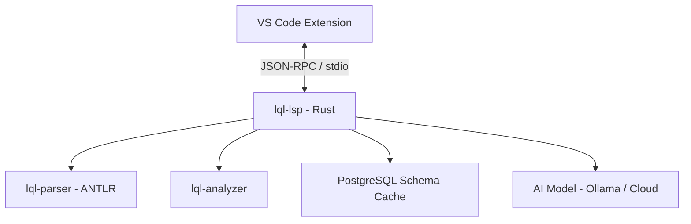

The LQL Language Server (`lql-lsp`) is a native Rust implementation that provides IDE features for `.lql` files. It communicates via the Language Server Protocol (LSP) over JSON-RPC on stdin/stdout.

Key capabilities: schema-aware completions via [Database Configuration](/docs/database-config/), intelligent suggestions via [AI-Powered Completions](/docs/ai-integration/), real-time diagnostics, hover documentation, and formatting.

## Architecture



Built with:
- **tower-lsp** - LSP protocol framework (JSON-RPC, message framing)
- **antlr-rust** - ANTLR4 grammar-based parser with error recovery
- **tokio** - Async runtime for concurrent schema fetching and AI calls
- **tokio-postgres** - PostgreSQL client for schema introspection
- **reqwest** - HTTP client for AI provider communication

## LSP Capabilities

The server registers these capabilities on initialization:

| Capability | Description |
|------------|-------------|
| `textDocumentSync: Full` | Full document synced on every change |
| `completionProvider` | Triggered by: `.` `\|` `>` `(` ` ` |
| `hoverProvider` | Hover info for keywords, tables, columns |
| `documentSymbolProvider` | `let` bindings shown in outline |
| `documentFormattingProvider` | Full-document formatting |

## Completion Engine

Completions are organized into priority layers. Lower numbers appear first:

| Priority | Category | Count | Requires DB |
|----------|----------|-------|-------------|
| 0 | Column completions (`table.col`) | Per-table | Yes |
| 1 | Pipeline operations | 14 | No |
| 2 | Functions (aggregate, string, math, date) | 40+ | No |
| 3 | Keywords | 30+ | No |
| 4 | Table names | Per-schema | Yes |
| 5 | Variable bindings (`let` names) | Per-document | No |
| 6 | AI completions | Variable | Optional |

### Context Detection

The completion engine detects context to filter suggestions:

- **After `|>`** - Shows pipeline operations
- **After `table.`** - Shows columns for that table
- **In argument list** - Shows functions, columns, keywords
- **In lambda body** - Shows row field access patterns
- **Word prefix** - Filters all completions by typed prefix

### Trigger Characters

Completions auto-trigger on: `.` (column access), `|` and `>` (pipe), `(` (function args), ` ` (space after pipe).

### AI Completion Pipeline

When an [AI provider is configured](/docs/ai-integration/), the LSP merges AI-generated completions with schema and keyword results on every request:

1. Schema + keyword completions are computed synchronously (instant)
2. AI completions are requested asynchronously via HTTP (e.g., Ollama `/api/generate`)
3. A configurable timeout (default 2000ms) wraps the AI call
4. If AI responds in time, results are appended at priority 6
5. If AI times out, only schema + keyword results are returned - no latency penalty

The AI model receives full context: document text, cursor position, line prefix, word prefix, and a compact schema description (e.g., `users(id uuid PK NOT NULL, name text, email text)`). This enables schema-aware suggestions even from small local models.

See [AI-Powered Completions](/docs/ai-integration/) for setup instructions and provider configuration.

## Diagnostics

Four categories of diagnostics, published on every document change:

### Parse Errors (ERROR)
From the ANTLR parser. Syntax errors with exact line/column positions:
```
-- Error: mismatched input 'selectt' expecting...
users |> selectt(users.id)
         ^^^^^^^^
```

### Bracket Validation (ERROR)
Document-level parenthesis matching:
```
-- Error: unclosed parenthesis
users |> select(users.id
                       ^
```

### Pipe Spacing (WARNING)
The `|>` operator should be surrounded by spaces:
```
-- Warning: pipe operator should be surrounded by spaces
users|>select(*)
     ^^
```

### Unknown Functions (INFO)
Functions not in the 82-entry known function list:
```
-- Info: unknown function 'foobar'
users |> foobar(users.id)
         ^^^^^^
```

## Hover Information

The hover database contains 50+ entries covering all LQL constructs.

### Keyword Hover
Hovering over `select`, `filter`, `join`, etc. shows descriptions with usage patterns.

### Schema-Aware Hover
With a [database connection](/docs/database-config/):

- **Table name hover** - Shows all columns with types, PK, and nullable indicators
- **Qualified column hover** (`users.email`) - Shows column type, nullability, primary key status

## Document Symbols

Extracts `let` bindings as `SymbolKind::Variable` for the VS Code outline and breadcrumb views:

```
let active_users = users |> filter(...)    -> Symbol: active_users
let orders_2024 = orders |> filter(...)    -> Symbol: orders_2024
```

## Formatting

The formatter applies consistent indentation rules:

- Pipeline continuations (`|>`) get 4-space indent
- Nested parentheses increase indent level
- Closing `)` decreases indent level
- Lines are trimmed of trailing whitespace
- Comments and blank lines are preserved

Before:
```
users
|> filter(fn(row) => row.users.active)
|> select(
users.id,
users.name
)
```

After:
```
users
    |> filter(fn(row) => row.users.active)
    |> select(
        users.id,
        users.name
    )
```

## Initialization Options

The server accepts configuration via `initializationOptions` during the LSP `initialize` handshake:

```json
{
  "connectionString": "host=localhost dbname=myapp user=postgres",
  "aiProvider": {
    "provider": "ollama",
    "endpoint": "http://localhost:11434",
    "model": "qwen2.5-coder:1.5b",
    "apiKey": "",
    "timeoutMs": 2000,
    "enabled": true
  }
}
```

See [Database Configuration](/docs/database-config/) and [VS Code Extension - AI Configuration](/docs/vscode/#ai-configuration) for details.

## Crate Structure

| Crate | Purpose |
|-------|---------|
| `lql-parser` | ANTLR grammar, lexer, parser, parse tree, error recovery |
| `lql-analyzer` | Completions, diagnostics, hover database, symbols, schema cache |
| `lql-lsp` | LSP server binary, tower-lsp integration, AI providers, DB client |

## Building from Source

```bash
cd Lql/lql-lsp-rust
cargo build --release
```

The binary is at `target/release/lql-lsp`.

### Running Tests

```bash
cargo test --workspace
```

### With Coverage

```bash
./test-coverage.sh
```

Individual crate coverage:

```bash
cargo tarpaulin --packages lql-parser --engine llvm --exclude-files "*/generated/*"
cargo tarpaulin --packages lql-analyzer --engine llvm
cargo tarpaulin --packages lql-lsp --engine llvm
```
