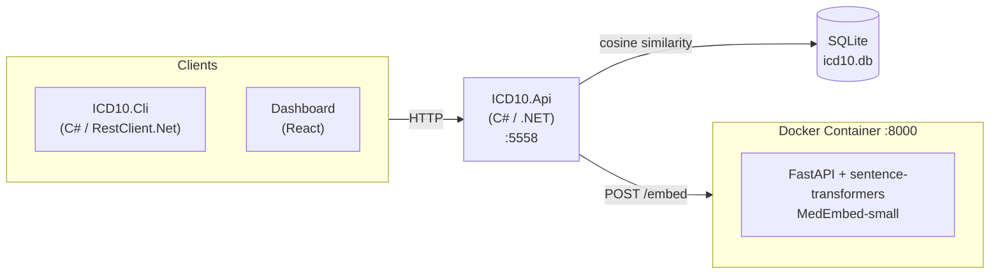

# ICD-10 Microservice

Universal RAG semantic search for ICD-10 diagnosis and procedure codes. Supports **any ICD-10 variant** including:

| Variant | Country | Edition Format | Example |
|---------|---------|----------------|---------|
| ICD-10-CM | United States | Year-based | "2025" |
| ICD-10-AM | Australia | Edition number | "13" |
| ICD-10-GM | Germany | Year-based | "2024" |
| ICD-10-CA | Canada | Year-based | "2024" |

The service is **country-agnostic** - the `Edition` column is stored as text to accommodate different versioning schemes across variants.

## Quick Start

```bash
# First time: create database and import codes
./scripts/CreateDb/import.sh

# Run the service
./scripts/run.sh
```

## Scripts

```
scripts/
├── run.sh                 # Run the API and embedding service
├── Dependencies/          # Docker services
│   ├── start.sh           # Start embedding service container
│   └── stop.sh            # Stop embedding service container
└── CreateDb/              # First-time database setup
    ├── import.sh          # Migrate + import + embeddings
    ├── import_icd10cm.py  # Import codes (US CM data source)
    ├── generate_embeddings.py
    ├── generate_sample_data.py
    └── requirements.txt
```

| Script/Folder | Purpose |
|---------------|---------|
| `run.sh` | Run the API and dependencies |
| `Dependencies/` | Start/stop Docker services (embedding service) |
| `CreateDb/` | One-time setup: migrate schema, import codes, generate embeddings |

## Test It

```bash
# Health check
curl http://localhost:5558/health

# RAG semantic search
curl -X POST http://localhost:5558/api/search \
  -H "Content-Type: application/json" \
  -d '{"Query": "chest pain with shortness of breath", "Limit": 10}'

# Direct code lookup
curl http://localhost:5558/api/icd10/codes/R07.4
```

## Run E2E Tests

```bash
cd ICD10.Api.Tests
dotnet test
```

## API Endpoints

| Method | Endpoint | Description |
|--------|----------|-------------|
| GET | `/health` | Health check |
| POST | `/api/search` | RAG semantic search |
| GET | `/api/icd10/codes/{code}` | Direct code lookup |
| GET | `/api/icd10/codes` | List codes (paginated) |
| GET | `/api/icd10/chapters` | List chapters |
| GET | `/api/achi/blocks` | ACHI procedure blocks |
| GET | `/api/achi/codes/{code}` | ACHI procedure lookup |

## Architecture



**Single Database**: All clients (CLI, Dashboard) access data through the API. The API owns the database. No client accesses the database directly.

## Database Schema

The unified schema supports any ICD-10 variant:

- **icd10_chapter** - Top-level classification chapters
- **icd10_block** - Code range blocks within chapters
- **icd10_category** - Three-character categories
- **icd10_code** - Full diagnosis codes with `Edition` and `Synonyms`
- **icd10_code_embedding** - Pre-computed embeddings for RAG search
- **achi_block** - ACHI procedure blocks
- **achi_code** - ACHI procedure codes with `Edition`
- **achi_code_embedding** - ACHI embeddings

## Environment Variables

| Variable | Description | Default |
|----------|-------------|---------|
| `DbPath` | Path to SQLite database | `icd10.db` |
| `EmbeddingService:BaseUrl` | Embedding service URL | `http://localhost:8000` |

## Troubleshooting

### "Embedding service unavailable"
Start the Docker container:
```bash
./scripts/Dependencies/start.sh
```

### "No embeddings found"
Run `CreateDb/import.sh` - RAG search requires pre-computed embeddings.

### "Database not found"
Run `CreateDb/import.sh` first.
