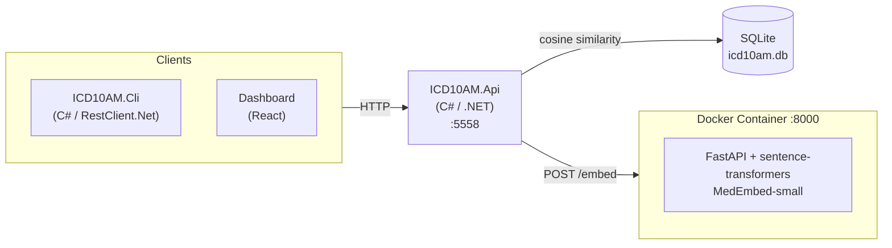

# ICD-10-CM Microservice

RAG semantic search for 74,260 ICD-10-CM diagnosis codes. C# API with Docker-based embedding service.

## Quick Start

```bash
# First time: create database and import codes
./scripts/CreateDb/import.sh

# Run the service
./scripts/run.sh
```

## Scripts

```
scripts/
├── run.sh                 # Run the API and embedding service
├── Dependencies/          # Docker services
│   ├── start.sh           # Start embedding service container
│   └── stop.sh            # Stop embedding service container
└── CreateDb/              # First-time database setup
    ├── import.sh          # Migrate + import + embeddings
    ├── import_icd10cm.py  # Import codes from CMS.gov
    ├── generate_embeddings.py
    ├── generate_sample_data.py
    └── requirements.txt
```

| Script/Folder | Purpose |
|---------------|---------|
| `run.sh` | Run the API and dependencies |
| `Dependencies/` | Start/stop Docker services (embedding service) |
| `CreateDb/` | One-time setup: migrate schema, import codes, generate embeddings |

## Test It

```bash
# Health check
curl http://localhost:5558/health

# RAG semantic search
curl -X POST http://localhost:5558/api/search \
  -H "Content-Type: application/json" \
  -d '{"Query": "chest pain with shortness of breath", "Limit": 10}'

# Direct code lookup
curl http://localhost:5558/api/codes/R07.4
```

## Run E2E Tests

```bash
cd ICD10AM.Api.Tests
dotnet test
```

## API Endpoints

| Method | Endpoint | Description |
|--------|----------|-------------|
| GET | `/health` | Health check |
| POST | `/api/search` | RAG semantic search |
| GET | `/api/codes/{code}` | Direct code lookup |
| GET | `/api/codes` | List codes (paginated) |

## Architecture



**Single Database**: All clients (CLI, Dashboard) access data through the API. The API owns the database. No client accesses the database directly.

## Environment Variables

| Variable | Description | Default |
|----------|-------------|---------|
| `DbPath` | Path to SQLite database | `icd10cm.db` |
| `EmbeddingService:BaseUrl` | Embedding service URL | `http://localhost:8000` |

## Troubleshooting

### "Embedding service unavailable"
Start the Docker container:
```bash
./scripts/Dependencies/start.sh
```

### "No embeddings found"
Run `CreateDb/import.sh` - RAG search requires pre-computed embeddings.

### Tests fail with "database not found"
Run `CreateDb/import.sh` first.
