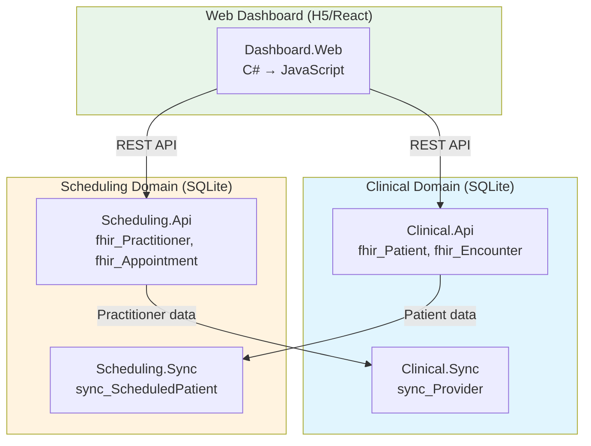

# Healthcare Samples

Two decoupled microservices demonstrating DataProvider, LQL, and domain-specific sync.

## Architecture



## Data Ownership & Sync Mapping

Each domain owns its FHIR resources (prefixed `fhir_`) and receives **mapped** copies from other domains (prefixed `sync_`).

| Domain | Owns (fhir_*) | Receives via Sync (sync_*) |
|--------|---------------|----------------------------|
| **Clinical** | fhir_Patient, fhir_Encounter, fhir_Condition, fhir_AllergyIntolerance, fhir_MedicationStatement, fhir_Observation | sync_Provider (mapped from Scheduling's fhir_Practitioner) |
| **Scheduling** | fhir_Practitioner, fhir_Appointment, fhir_Schedule, fhir_Slot | sync_ScheduledPatient (mapped from Clinical's fhir_Patient) |

### Sync Mapping Examples

**Practitioner → Provider** (Scheduling → Clinical):
```
fhir_Practitioner.Id          → sync_Provider.ProviderId
fhir_Practitioner.NameGiven   → sync_Provider.FirstName
fhir_Practitioner.NameFamily  → sync_Provider.LastName
fhir_Practitioner.Specialty   → sync_Provider.Specialty
```

**Patient → ScheduledPatient** (Clinical → Scheduling):
```
fhir_Patient.Id                              → sync_ScheduledPatient.PatientId
concat(GivenName, ' ', FamilyName)           → sync_ScheduledPatient.DisplayName
fhir_Patient.Phone                           → sync_ScheduledPatient.ContactPhone
fhir_Patient.Email                           → sync_ScheduledPatient.ContactEmail
```

## Project Structure

```
Samples/
├── readme.md
├── Clinical/
│   ├── Clinical.Api/          # ASP.NET Core Minimal API (SQLite)
│   │   ├── Program.cs
│   │   ├── Queries/*.sql      # External SQL queries
│   │   └── schema.sql         # fhir_* and sync_* tables
│   └── Clinical.Sync/         # Incoming sync from Scheduling
│       ├── Program.cs
│       └── SyncMappings.json  # Practitioner → Provider mapping
├── Scheduling/
│   ├── Scheduling.Api/        # ASP.NET Core Minimal API (SQLite)
│   │   ├── Program.cs
│   │   ├── Queries/*.sql      # External SQL queries
│   │   ├── Queries/*.lql      # External LQL queries
│   │   └── schema.sql         # fhir_* and sync_* tables
│   └── Scheduling.Sync/       # Incoming sync from Clinical
│       ├── Program.cs
│       └── SyncMappings.json  # Patient → ScheduledPatient mapping
└── Dashboard/
    └── Dashboard.Web/         # React dashboard (H5 transpiler)
        ├── wwwroot/           # Static HTML/CSS/JS
        └── *.cs               # C# → JavaScript components
```

## Running the Services

### Prerequisites

- .NET 9.0 SDK
- PostgreSQL (for Scheduling domain) or Docker

### Clinical API (SQLite)

No database setup required - SQLite creates the database automatically.

```bash
cd Samples/Clinical/Clinical.Api
dotnet run
```

Endpoints:
- `GET /fhir/Patient` - List patients
- `GET /fhir/Patient/{id}` - Get patient by ID
- `POST /fhir/Patient` - Create patient
- `GET /fhir/Patient/_search?q=smith` - Search patients
- `GET /sync/changes?fromVersion=0` - Get changes for sync
- `GET /sync/origin` - Get origin ID

### Scheduling API (PostgreSQL)

Requires PostgreSQL. Use Docker:

```bash
docker run -d --name clinic-postgres \
  -e POSTGRES_USER=clinic \
  -e POSTGRES_PASSWORD=clinic123 \
  -e POSTGRES_DB=clinic_scheduling \
  -p 5432:5432 \
  postgres:16

cd Samples/Scheduling/Scheduling.Api
dotnet run
```

Or set `POSTGRES_CONNECTION` environment variable.

Endpoints:
- `GET /Practitioner` - List practitioners
- `GET /Practitioner/{id}` - Get practitioner by ID
- `POST /Practitioner` - Create practitioner
- `GET /Appointment` - List upcoming appointments
- `POST /Appointment` - Create appointment
- `GET /sync/changes?fromVersion=0` - Get changes for sync
- `GET /sync/origin` - Get origin ID

### Running Sync Workers

Start the sync workers to pull data between domains:

```bash
# Pull Practitioner data into Clinical domain
cd Samples/Clinical/Clinical.Sync
dotnet run

# Pull Patient data into Scheduling domain
cd Samples/Scheduling/Scheduling.Sync
dotnet run
```

## FHIR Compliance

All entities follow [FHIR R4](https://build.fhir.org/resourcelist.html) resource definitions:

| Resource | Domain | Description |
|----------|--------|-------------|
| Patient | Clinical | Demographics, contact info, address |
| Encounter | Clinical | Patient visits/admissions |
| Condition | Clinical | Diagnoses (ICD-10 codes) |
| AllergyIntolerance | Clinical | Allergies and intolerances |
| MedicationStatement | Clinical | Current medications (RxNorm) |
| Observation | Clinical | Lab results (LOINC codes) |
| Practitioner | Scheduling | Healthcare providers (NPI) |
| Appointment | Scheduling | Scheduled encounters |
| Schedule | Scheduling | Provider availability |
| Slot | Scheduling | Bookable time slots |

## Query Architecture

All queries are externalized to files (no embedded SQL/LQL strings):

- **`.sql` files** - Raw SQL queries
- **`.lql` files** - LQL (Lambda Query Language) that transpiles to SQL

Example LQL query (`GetUpcomingAppointments.lql`):
```
fhir_Appointment
|> filter status = 'booked'
|> orderBy start_time
|> limit 50
```

## Technology Stack

| Component | Clinical | Scheduling |
|-----------|----------|------------|
| Database | SQLite | PostgreSQL |
| Query Language | SQL | SQL + LQL |
| Sync Library | Sync.SQLite | Sync.Postgres |
| Framework | ASP.NET Core Minimal API | ASP.NET Core Minimal API |

## Web Dashboard

A modern React dashboard written in C# using the H5 transpiler (successor to Bridge.NET). The dashboard connects to both Clinical and Scheduling microservices.

### Features

- **Glassmorphic Design** - Modern, clean UI with blur effects and transparency
- **FHIR Data Display** - View patients, practitioners, appointments, and more
- **Real-time API Integration** - Connects to both Clinical and Scheduling APIs
- **Responsive Layout** - Works on desktop and mobile devices
- **Type-safe React** - React components written in C# with full type safety

### Technology Stack

- **H5 Transpiler** - Compiles C# to JavaScript
- **React 18** - UI framework (loaded via CDN)
- **Custom CSS** - Glassmorphism design system with no external dependencies

### Project Structure

```
Dashboard/
└── Dashboard.Web/
    ├── Dashboard.Web.csproj    # H5 project configuration
    ├── Program.cs              # Application entry point
    ├── App.cs                  # Main React application component
    ├── GlobalUsings.cs         # Global using directives
    ├── React/                  # React interop layer
    │   ├── ReactInterop.cs     # Core React bindings
    │   ├── Hooks.cs            # React hooks (useState, useEffect)
    │   └── Elements.cs         # HTML element factories
    ├── Components/             # Reusable UI components
    │   ├── Sidebar.cs          # Navigation sidebar
    │   ├── Header.cs           # Top header with search
    │   ├── MetricCard.cs       # KPI metric cards
    │   ├── DataTable.cs        # Data table component
    │   └── Icons.cs            # SVG icon components
    ├── Pages/                  # Page components
    │   ├── DashboardPage.cs    # Main overview dashboard
    │   ├── PatientsPage.cs     # Patient management
    │   ├── PractitionersPage.cs # Practitioner management
    │   └── AppointmentsPage.cs # Appointment scheduling
    ├── Models/                 # Data models
    │   ├── ClinicalModels.cs   # Patient, Encounter, etc.
    │   └── SchedulingModels.cs # Practitioner, Appointment
    ├── Api/                    # API client
    │   └── ApiClient.cs        # HTTP client for microservices
    └── wwwroot/                # Static assets
        ├── index.html          # HTML entry point
        └── css/                # Stylesheets
            ├── variables.css   # CSS custom properties
            ├── base.css        # Base/reset styles
            ├── components.css  # Component styles
            └── layout.css      # Layout styles
```

### Running the Dashboard

The dashboard uses pure React 18 loaded from CDN with a complete JavaScript implementation in `index.html`. No build step required.

1. **Start the microservices** (in separate terminals):
   ```bash
   # Terminal 1: Clinical API
   cd Samples/Clinical/Clinical.Api
   dotnet run

   # Terminal 2: Scheduling API
   cd Samples/Scheduling/Scheduling.Api
   dotnet run
   ```

2. **Serve the dashboard** (using any static file server):
   ```bash
   # Using Python
   cd Samples/Dashboard/Dashboard.Web/wwwroot
   python3 -m http.server 8080

   # Or using .NET
   dotnet serve -p 8080 -d wwwroot
   ```

3. **Open in browser**: http://localhost:8080

### Configuration

The dashboard can be configured via a `window.dashboardConfig` object:

```html
<script>
  window.dashboardConfig = {
    CLINICAL_API_URL: 'http://localhost:5000',
    SCHEDULING_API_URL: 'http://localhost:5001'
  };
</script>
```

### Design System

The dashboard follows modern healthcare UI best practices:

| Element | Color | Usage |
|---------|-------|-------|
| Primary | `#2ca3fa` (Blue) | Actions, links, active states |
| Teal | `#00bcd4` | Accents, secondary indicators |
| Success | `#10b981` | Positive trends, active status |
| Warning | `#f59e0b` | Alerts, pending states |
| Error | `#ef4444` | Errors, cancelled states |

The design uses:
- 8px spacing grid
- Glassmorphic cards with blur effects
- Clean sans-serif typography
- Subtle shadows and rounded corners