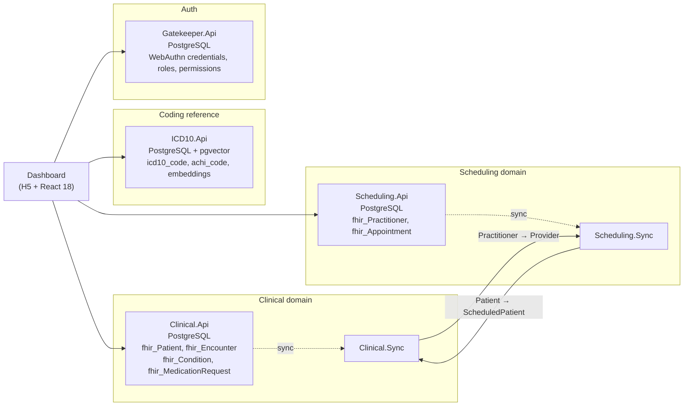

The **Nimblesite Clinical Coding Platform** is the official reference implementation for the DataProvider toolkit. It shows every package and CLI tool working together in a realistic multi-service healthcare application.

> **Technology demonstration only — not for production use.** No warranty, no clinical certification. See the [LICENSE](https://github.com/Nimblesite/ClinicalCoding/blob/main/LICENSE).

- **Repository**: [github.com/Nimblesite/ClinicalCoding](https://github.com/Nimblesite/ClinicalCoding)
- **License**: MIT © 2026 Nimblesite Pty Ltd
- **Platforms**: .NET 10, PostgreSQL + pgvector, Docker Compose


## What it does

Agentic ICD-10 coding driven by patient encounters, clinical notes, and semantic search:

- Patient encounters, observations, and clinical notes flow through FHIR R5 APIs
- Structured and free-text clinical data feeds an agentic ICD-10 coding pipeline
- `pgvector` embeddings semantically match clinical descriptions to 16,000+ ICD-10-AM codes
- Bidirectional sync between the Clinical and Scheduling domains keeps cross-domain records consistent
- WebAuthn passkeys + record-level RBAC gate every API

## Architecture



| Service     | URL                    | Purpose                                          |
|-------------|------------------------|--------------------------------------------------|
| Clinical    | `http://localhost:5080` | Patient, Encounter, Condition, MedicationRequest |
| Scheduling  | `http://localhost:5001` | Practitioner, Appointment, Schedule, Slot        |
| ICD10       | `http://localhost:5090` | Code search (text + semantic RAG), ACHI          |
| Gatekeeper  | `http://localhost:5000` | WebAuthn auth + RBAC                             |
| Dashboard   | `http://localhost:8080` | React UI (H5 transpiler from C#)                 |

## Tech stack

| Layer          | Technology                                      |
|----------------|-------------------------------------------------|
| Backend        | .NET 10, ASP.NET Core Minimal API               |
| Database       | PostgreSQL 16 + pgvector (4 databases)          |
| Data access    | DataProvider (build-time generated SQL)         |
| Query language | LQL (Lambda Query Language)                     |
| Migrations     | DataProviderMigrate (YAML schemas)              |
| Sync           | Nimblesite Sync framework (bidirectional)       |
| Auth           | Gatekeeper (WebAuthn + RBAC)                    |
| Embeddings     | MedEmbed via a FastAPI sidecar                  |
| Frontend       | H5 compiler (C# → JS) + React 18                |
| Infrastructure | Docker Compose                                  |

## DataProvider tools it uses

The repo's `.config/dotnet-tools.json` pins the three DataProvider CLI tools:

```json
{
  "version": 1,
  "isRoot": true,
  "tools": {
    "dataprovider":        { "version": "{{ versions.dataprovider }}", "commands": ["DataProvider"] },
    "dataprovidermigrate": { "version": "{{ versions.dataproviderMigrate }}", "commands": ["DataProviderMigrate"] },
    "lql":                 { "version": "{{ versions.lql }}", "commands": ["Lql"] }
  }
}
```

| Tool                  | Used for                                                                 |
|-----------------------|--------------------------------------------------------------------------|
| `DataProviderMigrate` | Applies all four YAML schemas to PostgreSQL via `make db-migrate`        |
| `Lql`                 | Transpiles `.lql` files to PostgreSQL at build time                      |
| `DataProvider`        | Generates type-safe `*Async` extension methods from each API's SQL/LQL   |

## Runtime NuGet packages it consumes

Every service references packages from the DataProvider toolkit:

| Package                          | Consumers                                                 |
|----------------------------------|-----------------------------------------------------------|
| `Nimblesite.DataProvider.Core`   | Clinical.Api, Scheduling.Api, ICD10.Api, Gatekeeper.Api   |
| `Nimblesite.DataProvider.Postgres` | All four API services                                   |
| `Nimblesite.Lql.Core`            | Clinical.Api, Scheduling.Api, ICD10.Api                   |
| `Nimblesite.Lql.Postgres`        | Clinical.Api, Scheduling.Api, ICD10.Api                   |
| `Nimblesite.Sync.Core`           | Clinical.Sync, Scheduling.Sync                            |
| `Nimblesite.Sync.Postgres`       | Clinical.Api, Scheduling.Api, Gatekeeper.Api              |
| `Nimblesite.Sync.Http`           | Clinical.Sync, Scheduling.Sync                            |
| `Nimblesite.Sql.Model`           | All services (transitive)                                 |

## FHIR R5 resources

The platform models the following [FHIR R5](https://build.fhir.org/resourcelist.html) resources as first-class database tables:

- **Clinical**: `Patient`, `Encounter`, `Condition`, `MedicationRequest`, `Observation`
- **Scheduling**: `Practitioner`, `Appointment`, `Schedule`, `Slot`

## ICD-10 country-agnostic support

One unified schema supports every major ICD-10 variant:

| Variant       | Country     | Data source          |
|---------------|-------------|----------------------|
| **ICD-10-CM** | USA         | CMS.gov (free)       |
| **ICD-10-AM** | Australia   | IHACPA (licensed)    |
| **ICD-10-GM** | Germany     | BfArM                |
| **ICD-10-CA** | Canada      | CIHI                 |

The Australian deployment additionally supports **ACHI** procedure codes.

## RAG semantic search

A clinical coder enters natural language and receives ranked ICD-10 suggestions with confidence scores, powered by MedEmbed embeddings stored in pgvector.

```json
POST /api/search
{
  "query": "chest pain with shortness of breath",
  "limit": 10,
  "format": "json"
}
```

Response:

```json
{
  "results": [
    { "code": "R07.4", "description": "Chest pain, unspecified", "confidence": 0.92 },
    { "code": "R06.0", "description": "Dyspnoea",                "confidence": 0.87 }
  ],
  "model": "MedEmbed-Large-v1"
}
```

### ICD-10 endpoints

| Endpoint                               | Description                                   |
|----------------------------------------|-----------------------------------------------|
| `GET /api/icd10/chapters`              | List ICD-10 chapters                          |
| `GET /api/icd10/chapters/{id}/blocks`  | Blocks within a chapter                       |
| `GET /api/icd10/codes/{code}`          | Direct code lookup (supports `?format=fhir`)  |
| `GET /api/icd10/codes?q={query}`       | Text search                                   |
| `POST /api/search`                     | RAG semantic search                           |
| `GET /api/achi/codes/{code}`           | ACHI procedure code lookup                    |

## Data ownership and sync

| Domain      | Owns                                                        | Receives via sync      |
|-------------|-------------------------------------------------------------|------------------------|
| Clinical    | Patient, Encounter, Condition, MedicationRequest            | Provider               |
| Scheduling  | Practitioner, Appointment, Schedule, Slot                   | ScheduledPatient       |
| ICD10       | Chapters, Blocks, Categories, Codes                         | (read-only reference)  |
| Gatekeeper  | WebAuthn credentials, roles, permissions                    | —                      |

Sync flows are implemented with `Nimblesite.Sync.Core` + `Nimblesite.Sync.Http` + `Nimblesite.Sync.Postgres`.

## Running it locally

```bash
git clone https://github.com/Nimblesite/ClinicalCoding.git
cd ClinicalCoding

# Everything in Docker (Postgres + 4 APIs + dashboard)
make start-docker

# Or: APIs run locally against a Postgres container
make start-local

# Apply YAML schemas to all four databases
make db-migrate

# Full CI run (lint + test + build)
make ci
```

Prerequisites: Docker, .NET 10 SDK, GNU Make.

## Why this is the canonical reference implementation

- Exercises every major DataProvider capability in one repo
- Build-time code generation via all three CLI tools (`DataProviderMigrate`, `Lql`, `DataProvider`)
- 100% `Result<T, SqlError>` — no thrown exceptions on the query path
- FHIR R5 compliance demonstrated against real healthcare resources
- Cross-domain bidirectional sync with conflict handling
- Passkey authentication with fine-grained RBAC

## Next Steps

- [Installation](/docs/installation/) — install the same tools the platform uses
- [Getting Started](/docs/getting-started/) — build a smaller version of this stack
- [DataProvider](/docs/dataprovider/) — the source generator in detail
- [LQL](/docs/lql/) — the query language
- [Sync](/docs/sync/) — the bidirectional sync framework
- [Gatekeeper](/docs/gatekeeper/) — WebAuthn + RBAC
